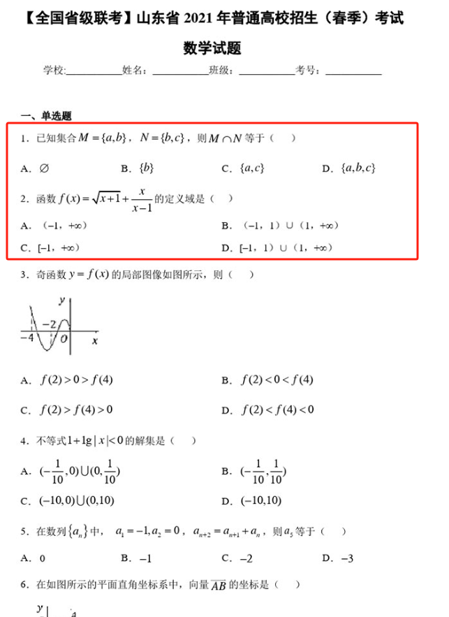

# 霖珊的学习记录 2024/05/13 ~ 2024/05/19

## 语文

### 1. 背笔记

- 时间：周一至周三的晚自习背诵，时长 20 至 30 分钟
- 内容：2 页笔记
- 程度：背熟
- 检查方法：政宏检查，录音发送至浩然
- 奖惩：50 人民币

??? failure "未检查，扣除 50 元"

<figure markdown>
  
  <figcaption>
笔记片段1
</figcaption>
  
  <figcaption>
笔记片段2
</figcaption>
  
  <figcaption>
笔记片段3
</figcaption>
  
  <figcaption>
笔记片段4
</figcaption>
</figure>

### 2. 寻求老师帮助，如何提高课外文言文的能力

## 数学

### 做辅导书

- 内容：学到哪写到哪
- 错题：找老师解答
- 检查方法：由浩然不定时检查
- 奖惩：50 人民币

??? success "奖励 50 元"

<figure markdown>
  
  <figcaption>
题目片段1
</figcaption>
  
  <figcaption>
题目片段2
</figcaption>
</figure>

## 英语

### 1. 背初中单词

- 内容：每周一个单元
- 检查方法：由浩然每周检查
- 奖惩：掷骰子+完美计划

??? failure "未检查，扣除 30 元"

<figure markdown>
  
  <figcaption>
听写1
</figcaption>
  
  <figcaption>
听写2
</figcaption>
  
  <figcaption>
听写3
</figcaption>
</figure>

### 2. 背高中单词

- 时间：周一至周二的晚自习背诵
- 内容：两周一个单元
- 检查方法：由浩然每周检查
- 奖惩：50 人民币

??? note "本周无需检查"

