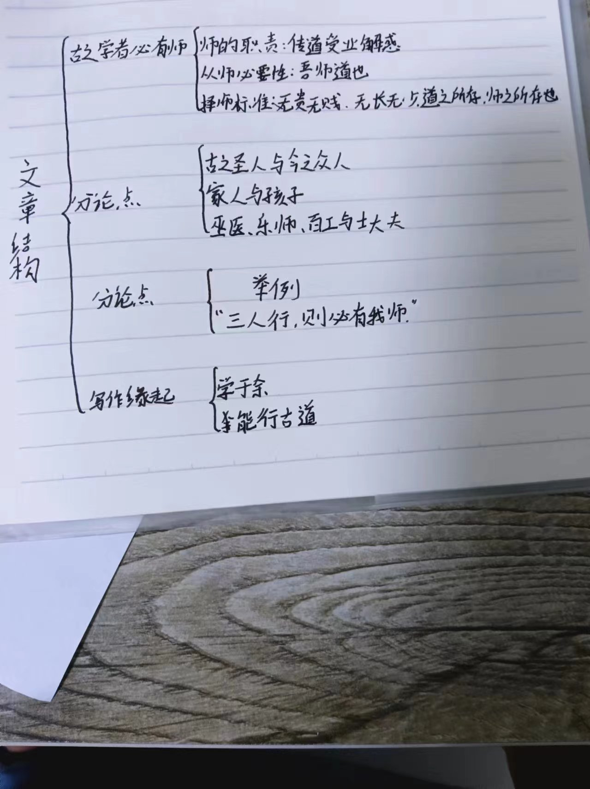
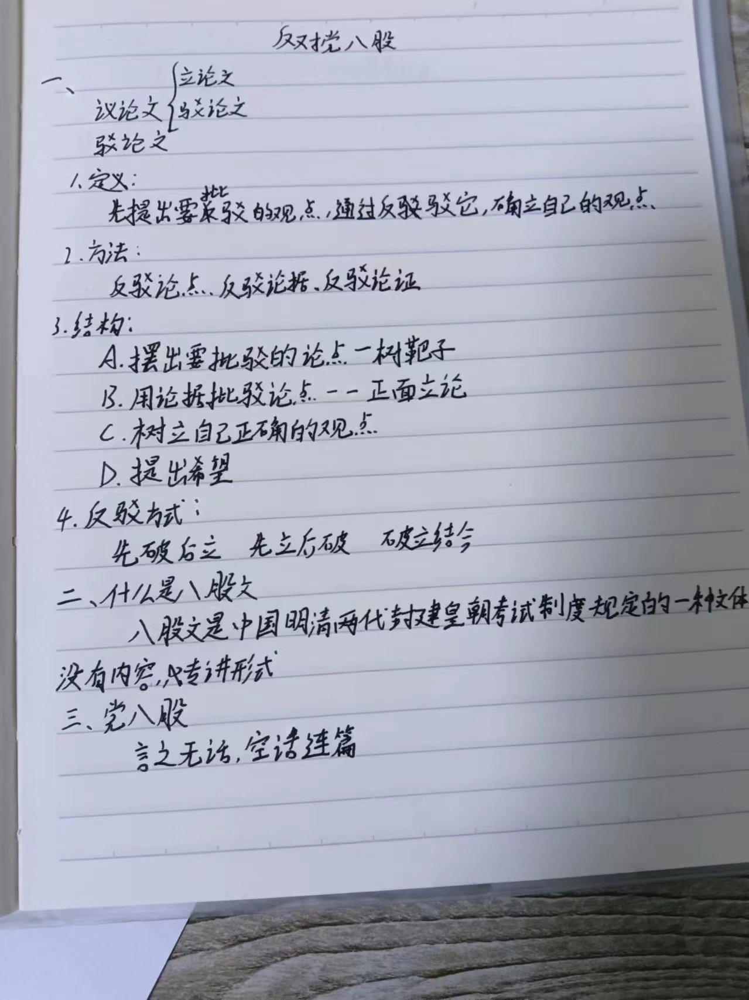
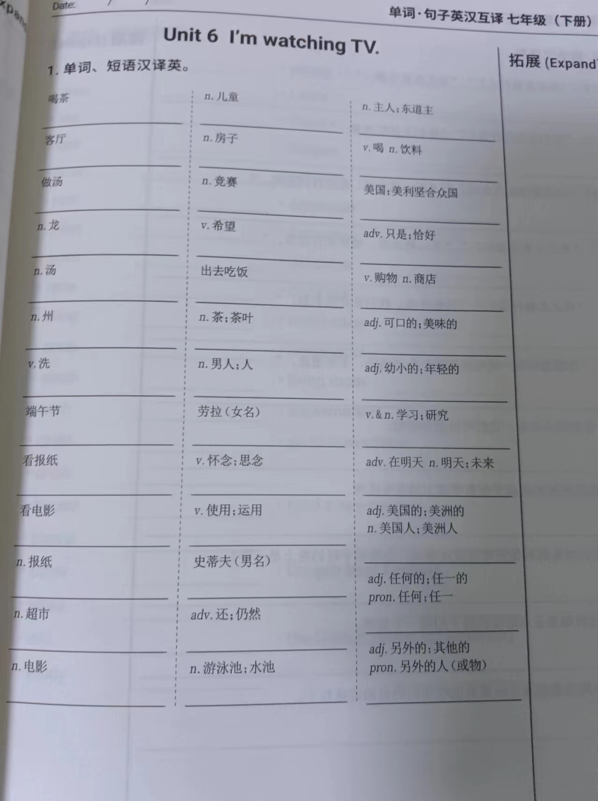
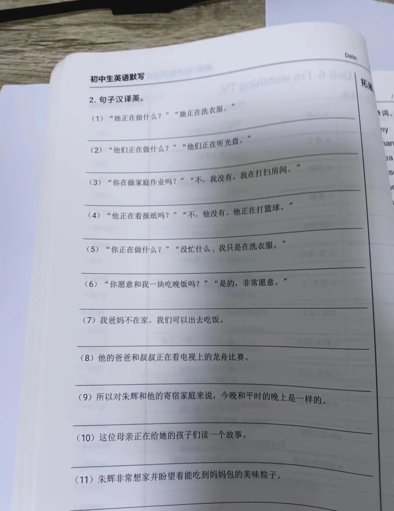
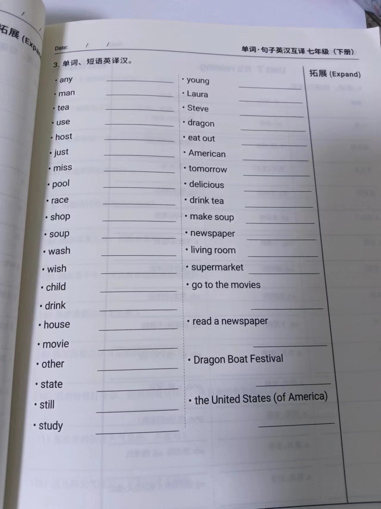
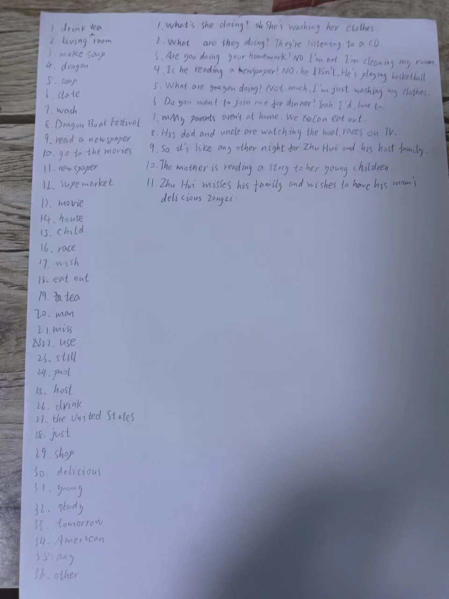

# 霖珊的学习记录 2024/06/03 ~ 2024/06/09

## 语文

### 1. 背笔记

- 时间：周一至周三的晚自习背诵，时长 20 至 30 分钟
- 内容：2 页笔记
- 程度：背熟
- 检查方法：政宏检查，录音发送至浩然
- 奖惩：50 人民币

??? success "奖励 30 元"

<figure markdown>
  
  <figcaption>
笔记1
</figcaption>
  
  <figcaption>
笔记2
</figcaption>
  
  <figcaption>
笔记3
</figcaption>
</figure>

### 2. 寻求老师帮助，如何提高课外文言文的能力

## 数学

### 做辅导书

- 内容：学到哪写到哪
- 错题：找老师解答
- 检查方法：由浩然不定时检查
- 奖惩：50 人民币

??? note "本周无需检查"

## 英语

### 1. 背初中单词

- 内容：每周一个单元
- 检查方法：由浩然每周检查
- 奖惩：掷骰子+完美计划

??? success "达成完美计划，奖励 120 元"

    - 骰子点数：1、6
    - 错误数：0
    - 应发奖励：60 人民币
    - 扣除奖励：0 人民币
    - 达成完美计划
    - 实际奖励：120 人民币

<figure markdown>
  
  <figcaption>
初中英语1
</figcaption>
  
  <figcaption>
初中英语2
</figcaption>
  
  <figcaption>
初中英语3
</figcaption>
</figure>

<figure markdown>
  
  <figcaption>
初中英语听写
</figcaption>
</figure>

### 2. 背高中单词

- 时间：周一至周二的晚自习背诵
- 内容：两周一个单元
- 检查方法：由浩然每周检查
- 奖惩：50 人民币

??? note "本周无需检查"

