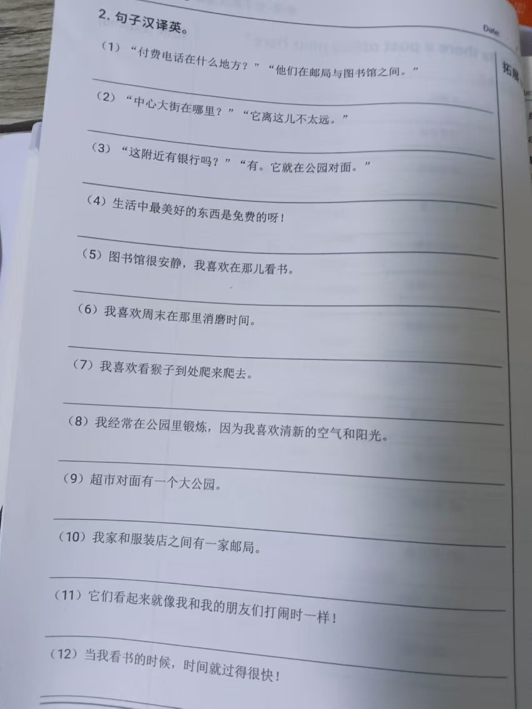

# 霖珊的学习记录 2024/11/25 ~ 2024/12/01

## 英语

### 1. 背初中单词

- 内容：每周一个单元
- 检查方法：由浩然每周检查
- 奖惩：掷骰子+完美计划

- [X] 已达成

- 备注
  - 骰子点数：1、6
  - 错误数：1
  - 应发奖励：60 人民币
  - 扣除奖励：10 人民币
  - 未达成完美计划
  - 实际奖励：50 人民币

<figure markdown>
  
  <figcaption>
初中英语1
</figcaption>
  
  <figcaption>
初中英语2
</figcaption>
  
  <figcaption>
初中英语3
</figcaption>
</figure>

<figure markdown>
  
  <figcaption>
初中英语听写
</figcaption>
</figure>

