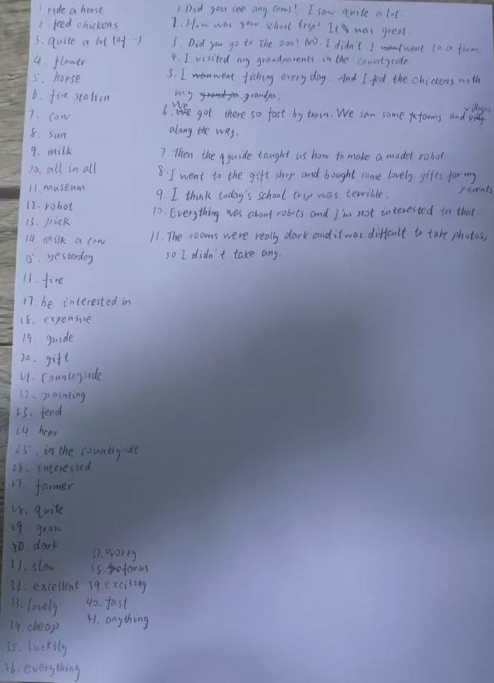

# 霖珊的学习记录 2024/12/16 ~ 2024/12/22

## 英语

### 1.1. 背初中单词

- 内容：每周一个单元
- 检查方法：由浩然每周检查
- 奖惩：掷骰子+完美计划

??? success "达成完美计划，奖励 100 元"

    - 骰子点数：2、5
    - 错误数：0
    - 应发奖励：50 人民币
    - 扣除奖励：0 人民币
    - 达成完美计划
    - 实际奖励：100 人民币

<figure markdown>
  
  <figcaption>
初中英语七年级下册Unit11-1
</figcaption>
  
  <figcaption>
初中英语七年级下册Unit11-2
</figcaption>
</figure>

<figure markdown>
  
  <figcaption>
初中英语七年级下册Unit11听写
</figcaption>
</figure>

