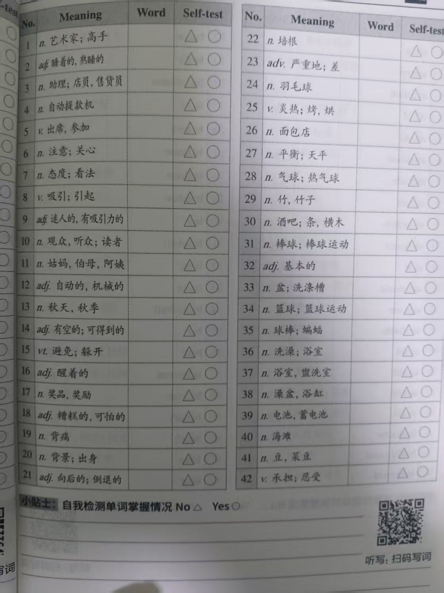
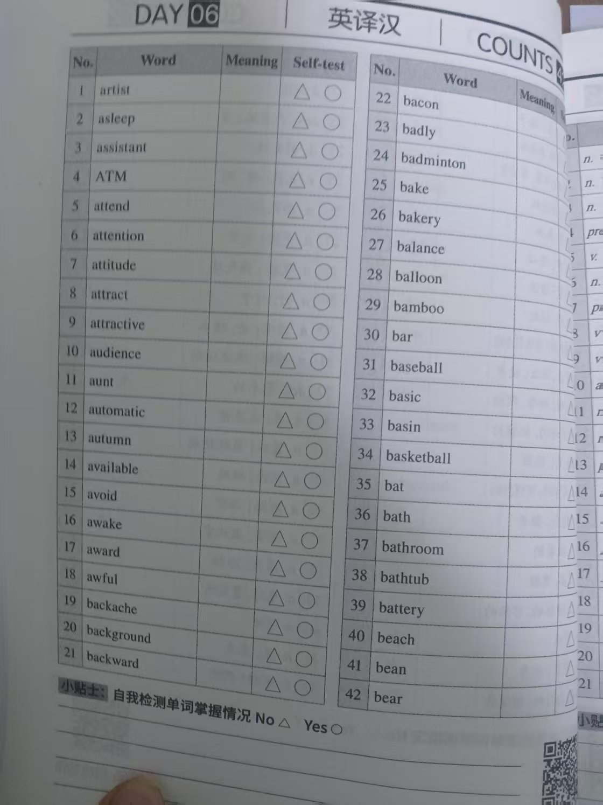
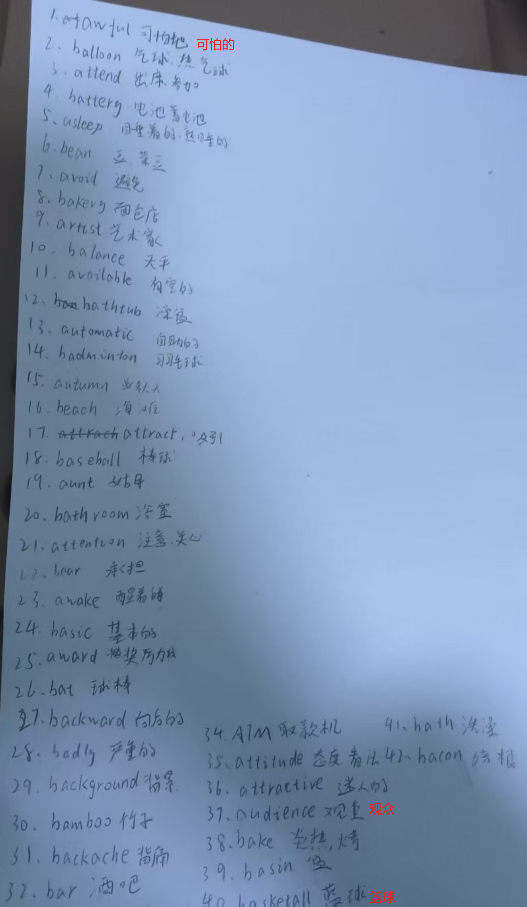
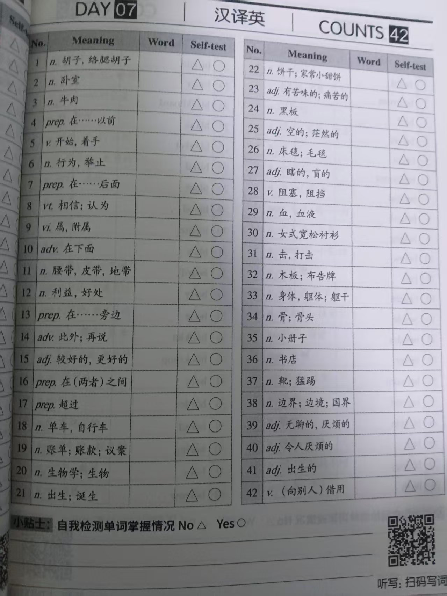
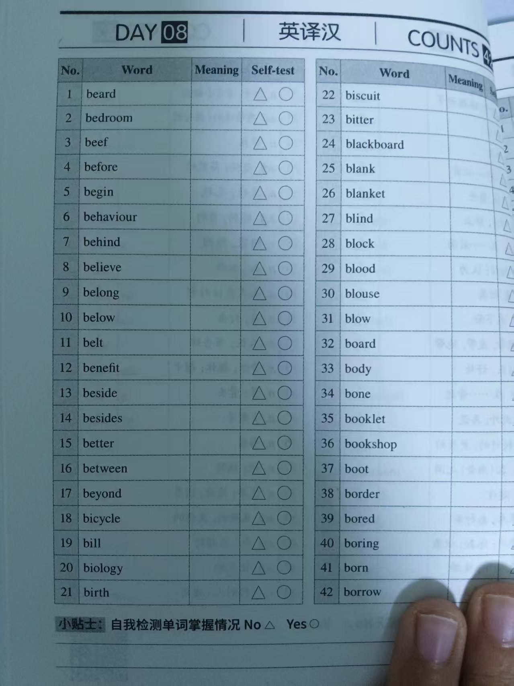
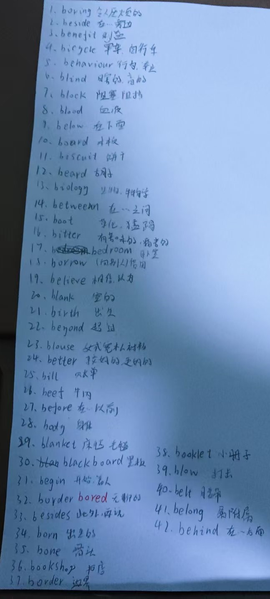

# 霖珊的学习记录 2025/02/17 ~ 2025/02/23

## 英语

### 背词汇表-1

- 内容：每周一个单元
- 检查方法：由浩然每周检查
- 奖惩：掷骰子+完美计划

- [X] 已达成

- 备注
  - 骰子点数：2、4
  - 错误数：4
  - 应发奖励：40 人民币
  - 扣除奖励：40 人民币
  - 未达成完美计划
  - 实际奖励：0 人民币

<figure markdown>
  
  <figcaption>
词汇表Unit3-1
</figcaption>
  
  <figcaption>
词汇表Unit3-2
</figcaption>
</figure>

<figure markdown>
  
  <figcaption>
词汇表Unit3-听写
</figcaption>
</figure>

### 背词汇表-2

- 内容：每周一个单元
- 检查方法：由浩然每周检查
- 奖惩：掷骰子+完美计划

- [X] 已达成

- 备注
  - 骰子点数：5、1
  - 错误数：1
  - 应发奖励：50 人民币
  - 扣除奖励：10 人民币
  - 未达成完美计划
  - 实际奖励：40 人民币

<figure markdown>
  
  <figcaption>
词汇表Unit4-1
</figcaption>
  
  <figcaption>
词汇表Unit4-2
</figcaption>
</figure>

<figure markdown>
  
  <figcaption>
词汇表Unit4-听写
</figcaption>
</figure>

