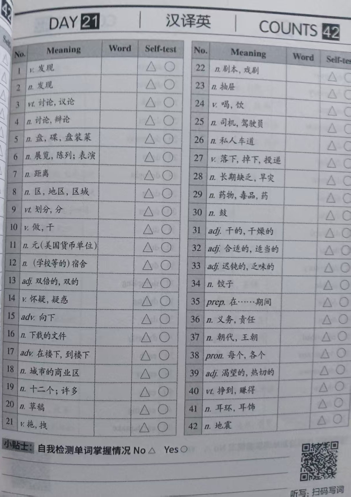
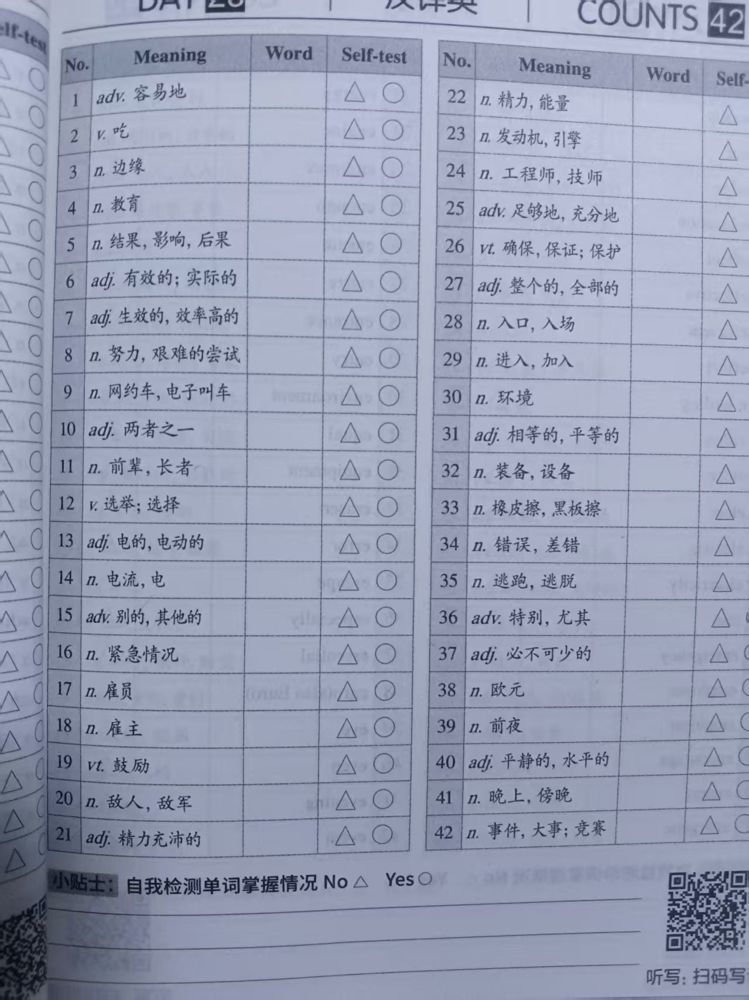
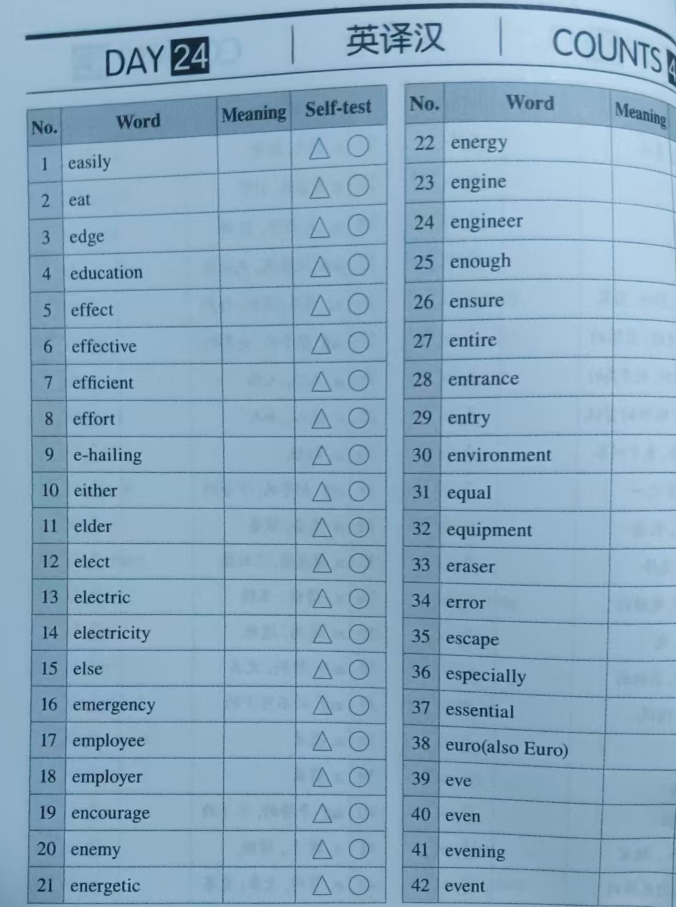
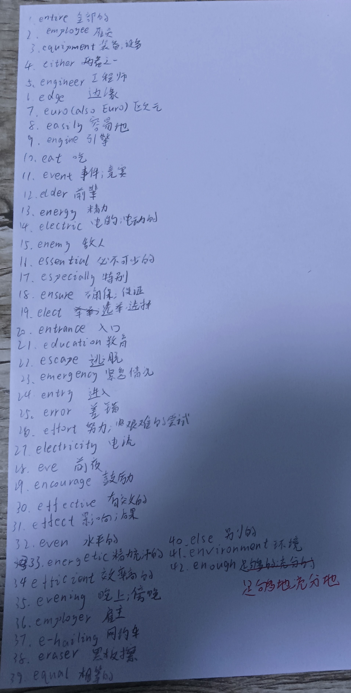

# 霖珊的学习记录 2025/03/17 ~ 2025/03/23

## 英语

### 背词汇表-1

- 内容：每周一个单元
- 检查方法：由浩然每周检查
- 奖惩：掷骰子+完美计划

- [X] 已达成

- 备注
  - 骰子点数：3、6
  - 错误数：0
  - 应发奖励：60 人民币
  - 扣除奖励：0 人民币
  - 达成完美计划
  - 实际奖励：120 人民币

<figure markdown>
  
  <figcaption>
词汇表Unit11-1
</figcaption>
  
  <figcaption>
词汇表Unit11-2
</figcaption>
</figure>

<figure markdown>
  
  <figcaption>
词汇表Unit11-听写
</figcaption>
</figure>

### 背词汇表-2

- 内容：每周一个单元
- 检查方法：由浩然每周检查
- 奖惩：掷骰子+完美计划

- [X] 已达成

- 备注
  - 骰子点数：3、5
  - 错误数：0
  - 应发奖励：50 人民币
  - 扣除奖励：0 人民币
  - 达成完美计划
  - 实际奖励：100 人民币

<figure markdown>
  
  <figcaption>
词汇表Unit12-1
</figcaption>
  
  <figcaption>
词汇表Unit12-2
</figcaption>
</figure>

<figure markdown>
  
  <figcaption>
词汇表Unit12-听写
</figcaption>
</figure>

