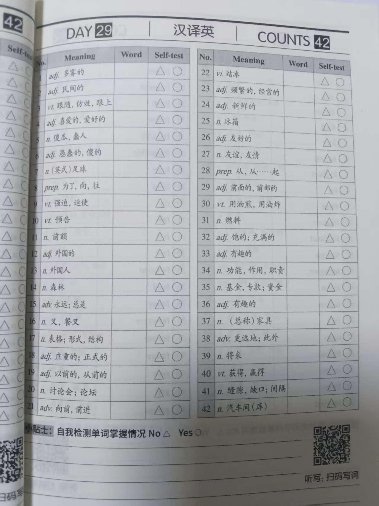
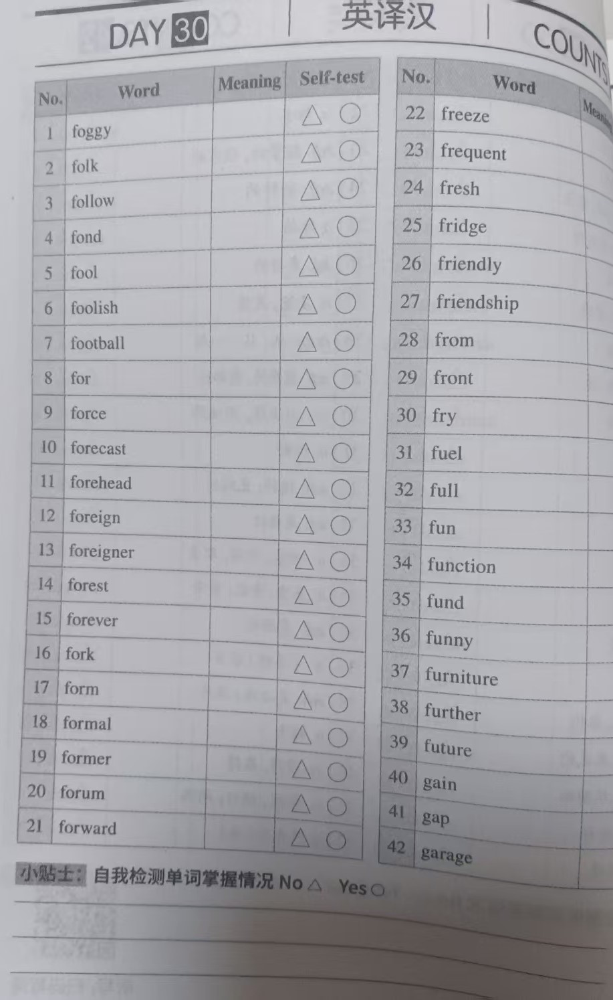
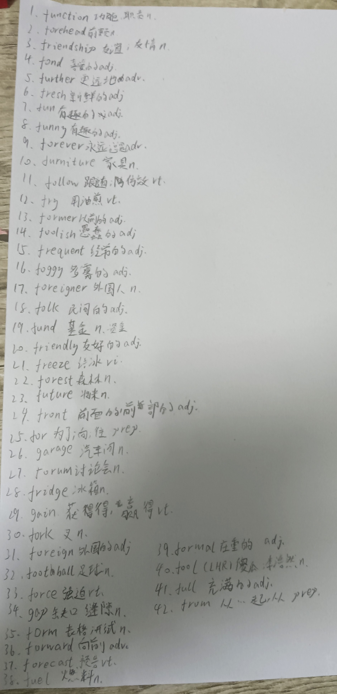
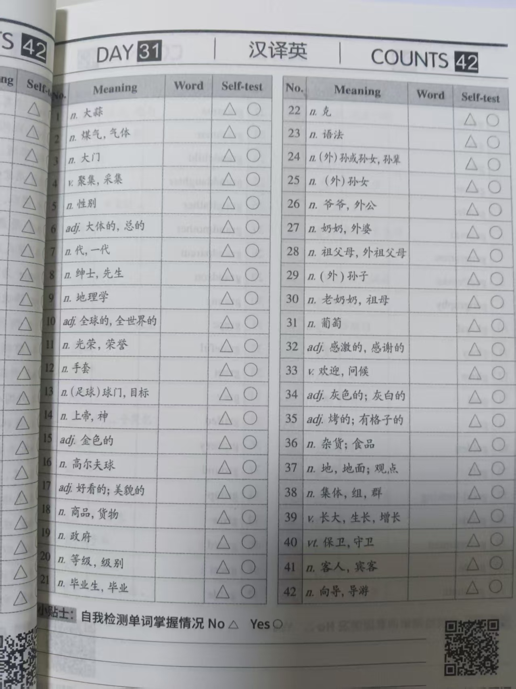
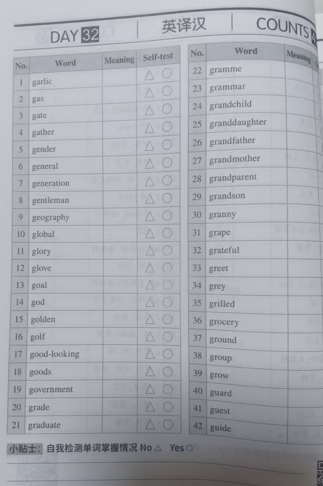
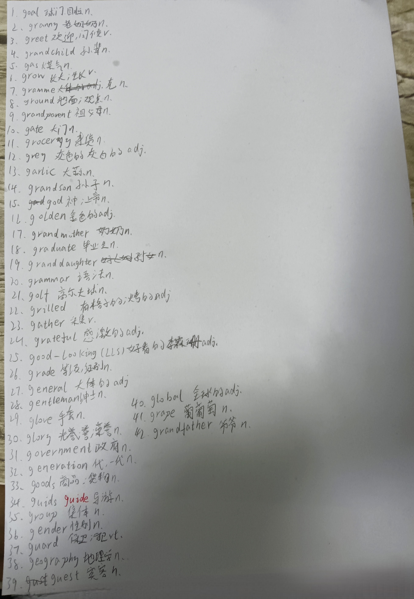

# 霖珊的学习记录 2025/04/07 ~ 2025/04/13

## 英语

### 背词汇表-1

- 内容：每周一个单元
- 检查方法：由浩然每周检查
- 奖惩：掷骰子+完美计划

??? success "达成完美计划，奖励 120 元"

    - 骰子点数：1、6
    - 错误数：0
    - 应发奖励：60 人民币
    - 扣除奖励：0 人民币
    - 达成完美计划
    - 实际奖励：120 人民币

<figure markdown>
  
  <figcaption>
词汇表Unit15-1
</figcaption>
  
  <figcaption>
词汇表Unit15-2
</figcaption>
</figure>

<figure markdown>
  
  <figcaption>
词汇表Unit15-听写
</figcaption>
</figure>

### 背词汇表-2

- 内容：每周一个单元
- 检查方法：由浩然每周检查
- 奖惩：掷骰子+完美计划

??? warning "有 1 处错误，扣除 10 元，净奖励 50 元"

    - 骰子点数：2、6
    - 错误数：1
    - 应发奖励：60 人民币
    - 扣除奖励：10 人民币
    - 未达成完美计划
    - 实际奖励：50 人民币

<figure markdown>
  
  <figcaption>
词汇表Unit16-1
</figcaption>
  
  <figcaption>
词汇表Unit16-2
</figcaption>
</figure>

<figure markdown>
  
  <figcaption>
词汇表Unit16-听写
</figcaption>
</figure>

