# 霖珊的学习记录 2025/05/12 ~ 2025/05/18

## 英语

### 背词汇表-1

- 内容：每周一个单元
- 检查方法：由浩然每周检查
- 奖惩：掷骰子+完美计划

??? success "达成完美计划，奖励 120 元"

    - 骰子点数：6、5
    - 错误数：0
    - 应发奖励：60 人民币
    - 扣除奖励：0 人民币
    - 达成完美计划
    - 实际奖励：120 人民币

<figure markdown>
  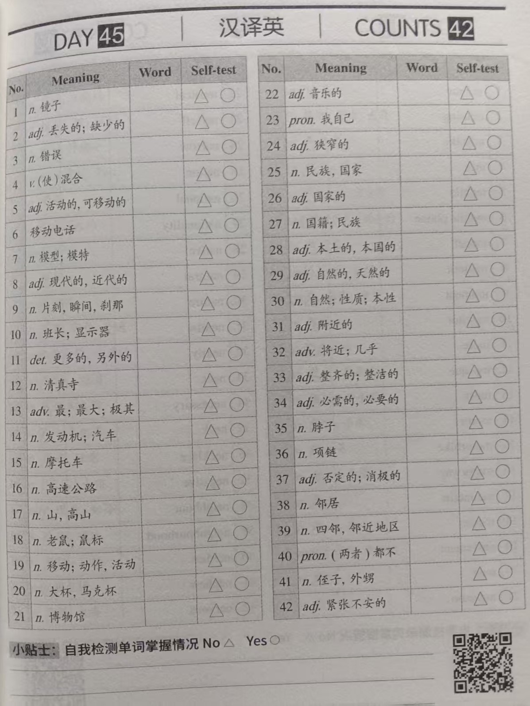
  <figcaption>
词汇表Unit23-1
</figcaption>
  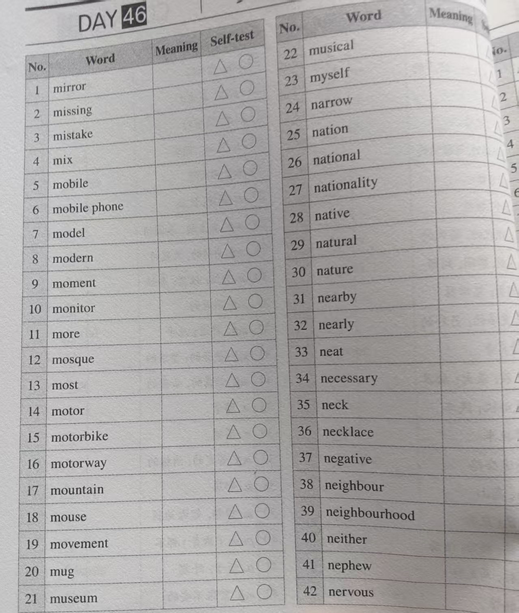
  <figcaption>
词汇表Unit23-2
</figcaption>
</figure>

<figure markdown>
  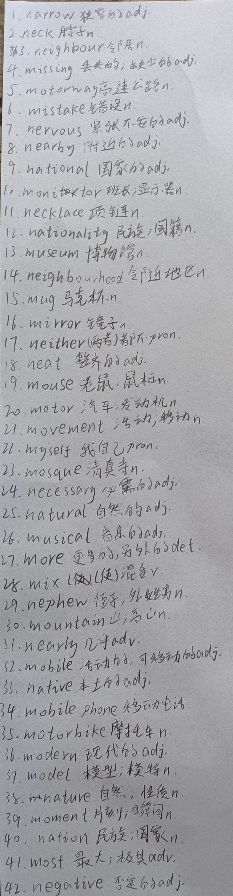
  <figcaption>
词汇表Unit23-听写
</figcaption>
</figure>

### 背词汇表-2

- 内容：每周一个单元
- 检查方法：由浩然每周检查
- 奖惩：掷骰子+完美计划

??? success "达成完美计划，奖励 120 元"

    - 骰子点数：6、5
    - 错误数：0
    - 应发奖励：60 人民币
    - 扣除奖励：0 人民币
    - 达成完美计划
    - 实际奖励：120 人民币

<figure markdown>
  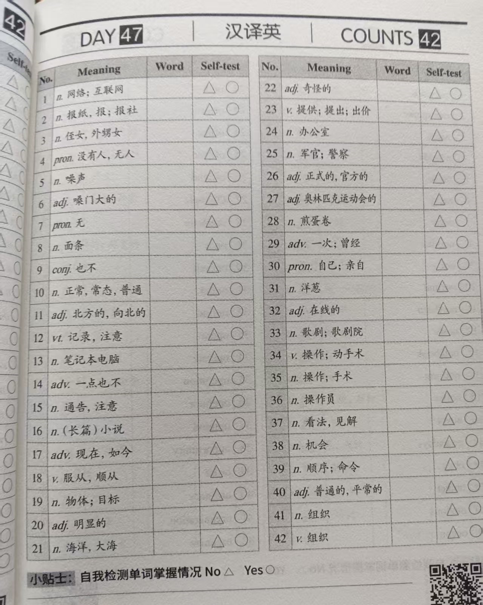
  <figcaption>
词汇表Unit24-1
</figcaption>
  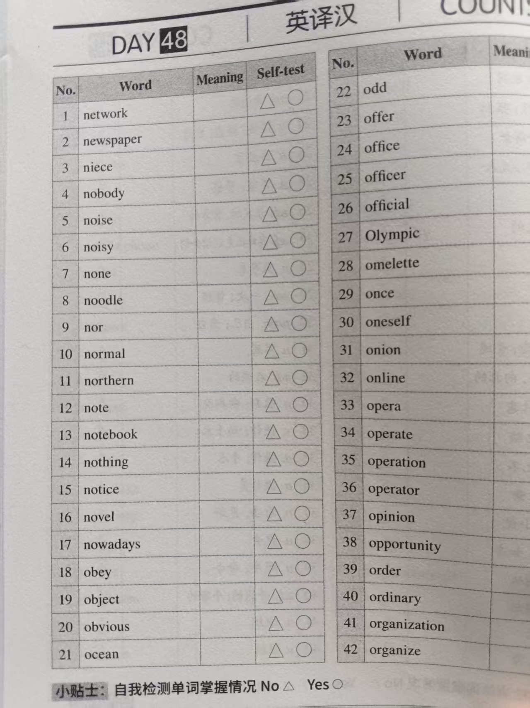
  <figcaption>
词汇表Unit24-2
</figcaption>
</figure>

<figure markdown>
  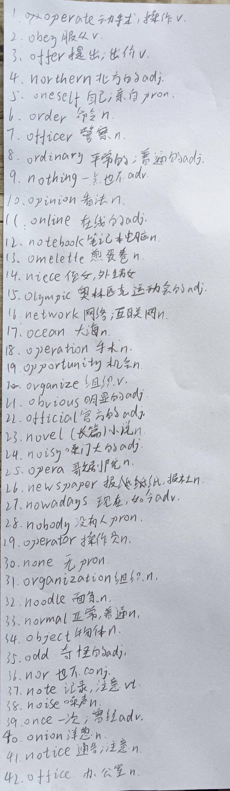
  <figcaption>
词汇表Unit24-听写
</figcaption>
</figure>

### 背词汇表-3

- 内容：每周一个单元
- 检查方法：由浩然每周检查
- 奖惩：掷骰子+完美计划

??? success "达成完美计划，奖励 120 元"

    - 骰子点数：6、5
    - 错误数：0
    - 应发奖励：60 人民币
    - 扣除奖励：0 人民币
    - 达成完美计划
    - 实际奖励：120 人民币

<figure markdown>
  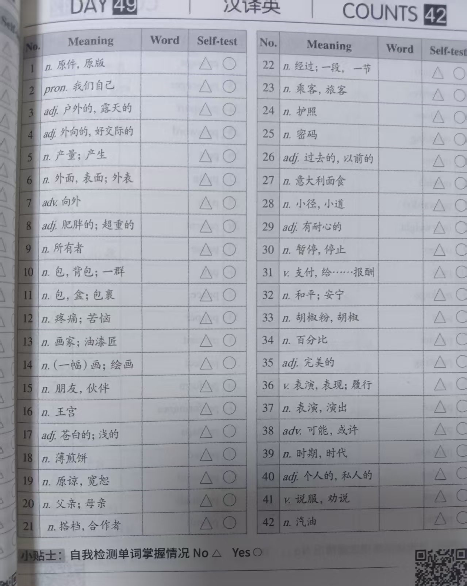
  <figcaption>
词汇表Unit25-1
</figcaption>
  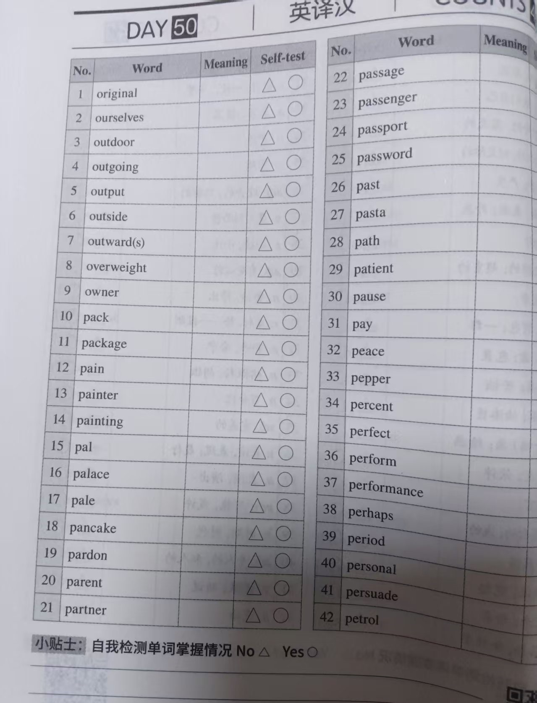
  <figcaption>
词汇表Unit25-2
</figcaption>
</figure>

<figure markdown>
  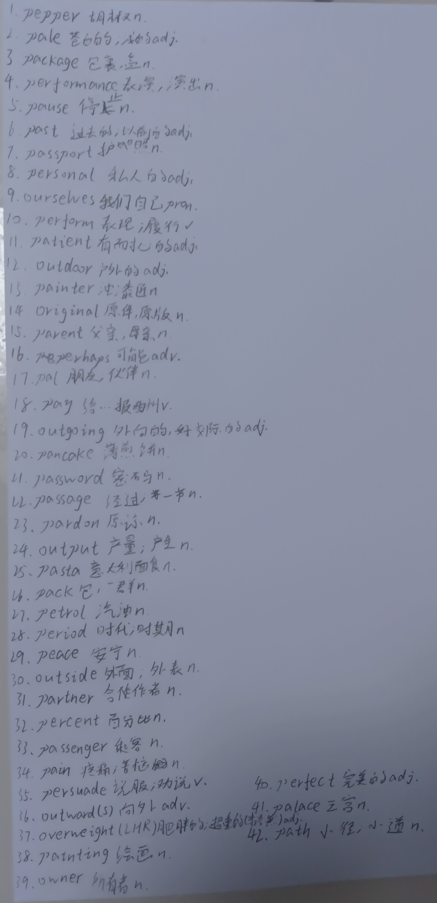
  <figcaption>
词汇表Unit25-听写
</figcaption>
</figure>

### 背词汇表-4

- 内容：每周一个单元
- 检查方法：由浩然每周检查
- 奖惩：掷骰子+完美计划

??? success "达成完美计划，奖励 120 元"

    - 骰子点数：6、5
    - 错误数：0
    - 应发奖励：60 人民币
    - 扣除奖励：0 人民币
    - 达成完美计划
    - 实际奖励：120 人民币

<figure markdown>
  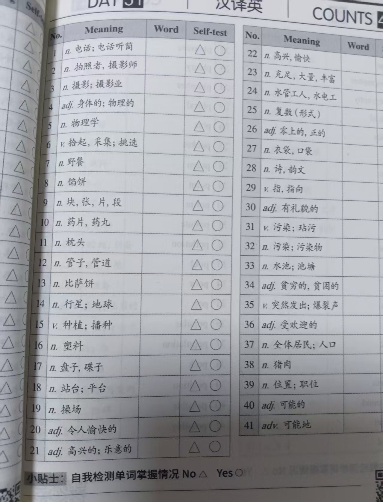
  <figcaption>
词汇表Unit26-1
</figcaption>
  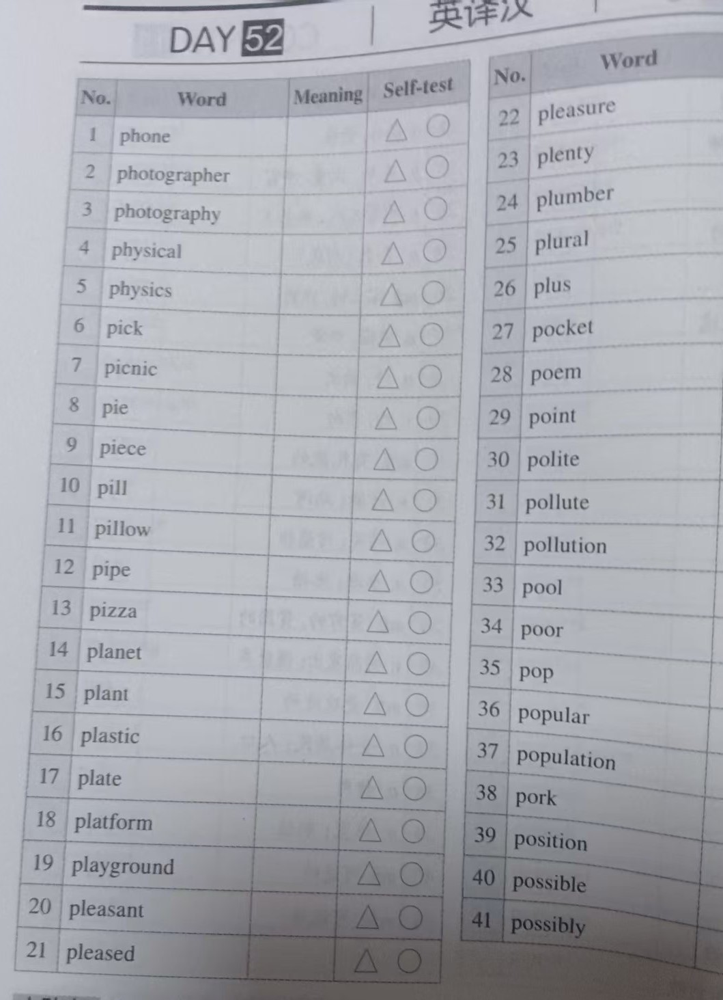
  <figcaption>
词汇表Unit26-2
</figcaption>
</figure>

<figure markdown>
  
  <figcaption>
词汇表Unit26-听写
</figcaption>
</figure>

