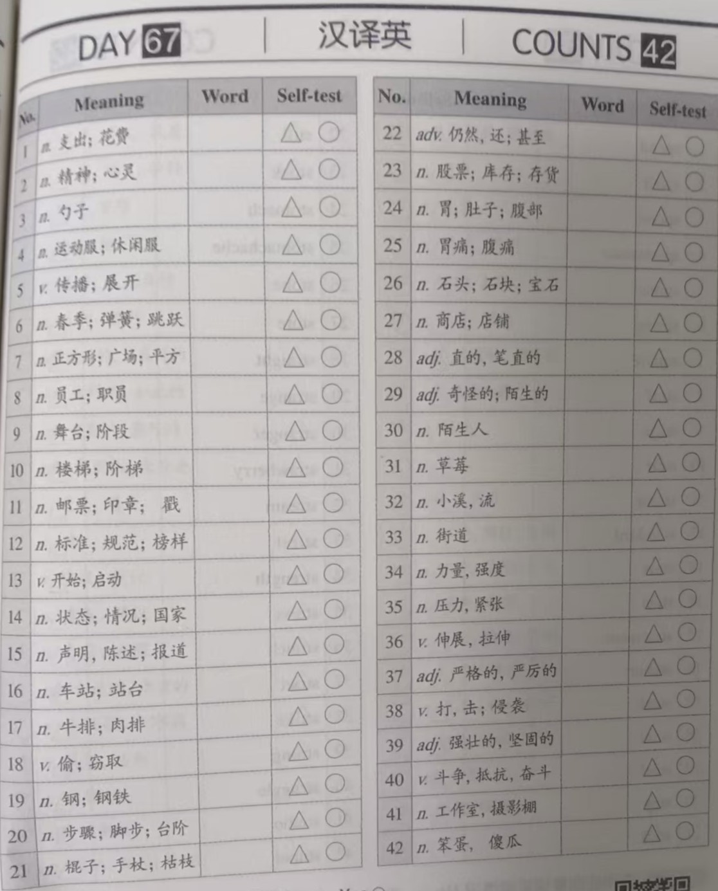
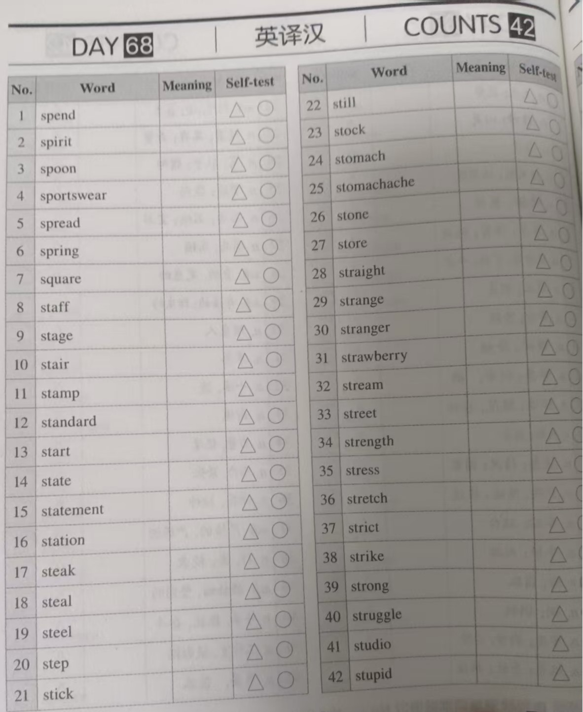
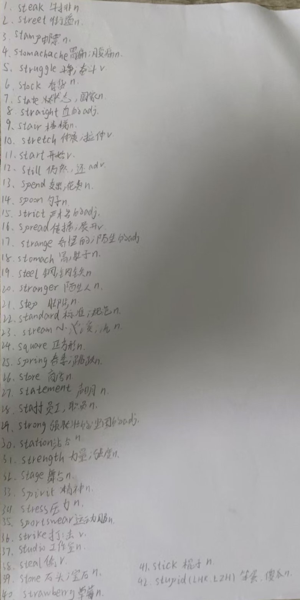
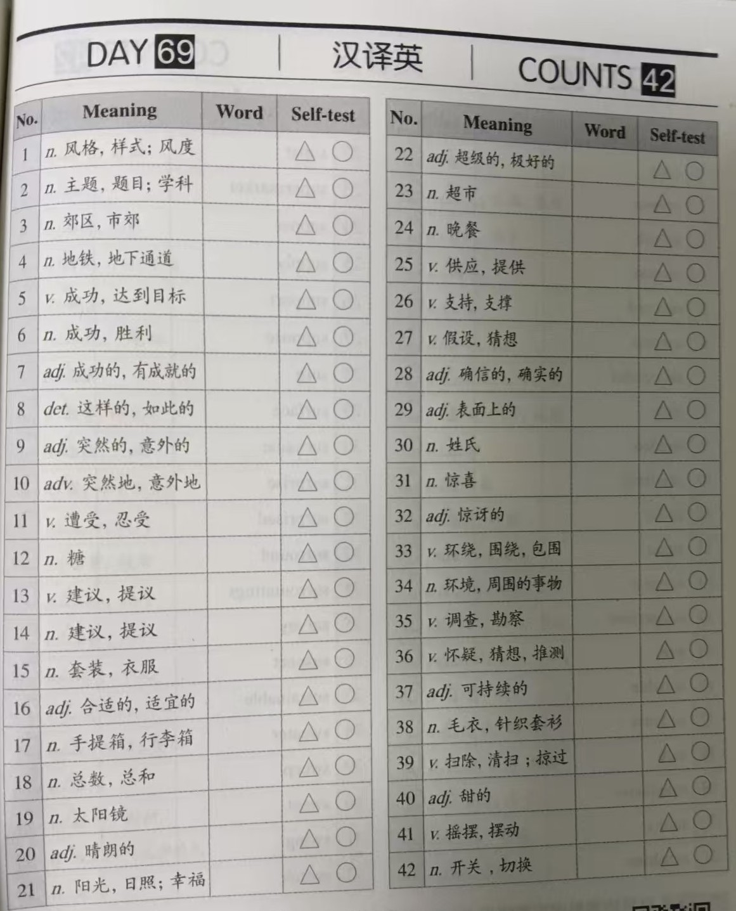
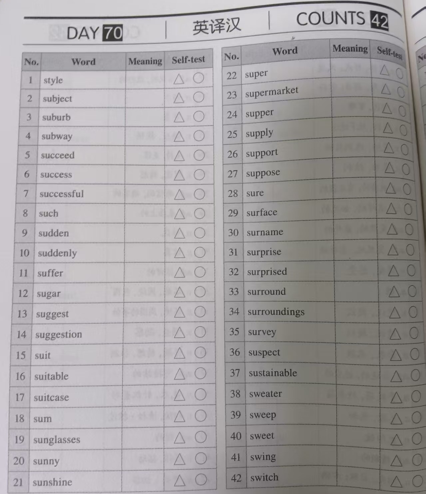
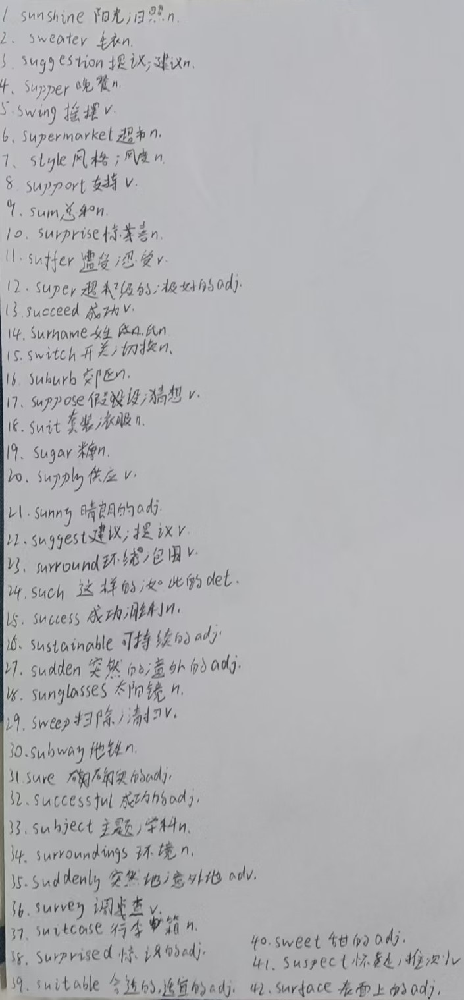
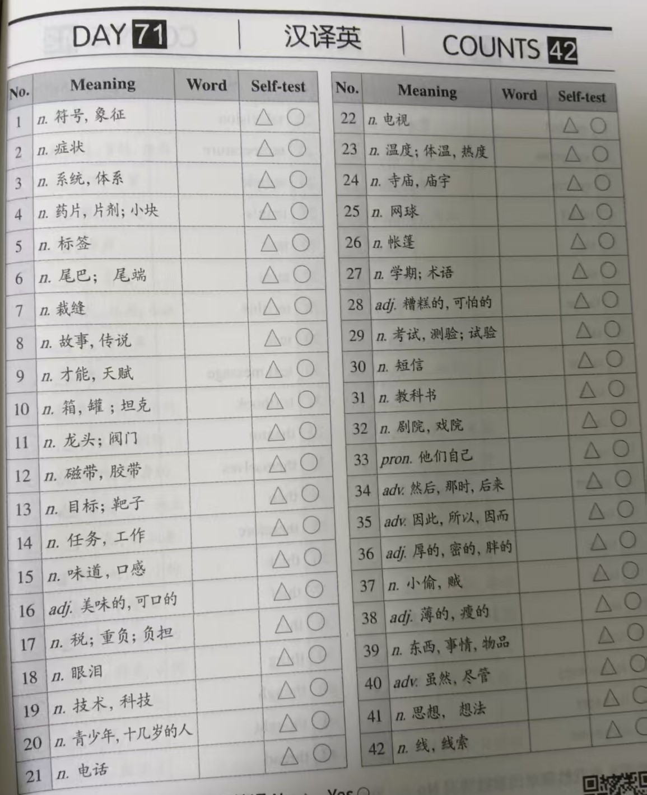
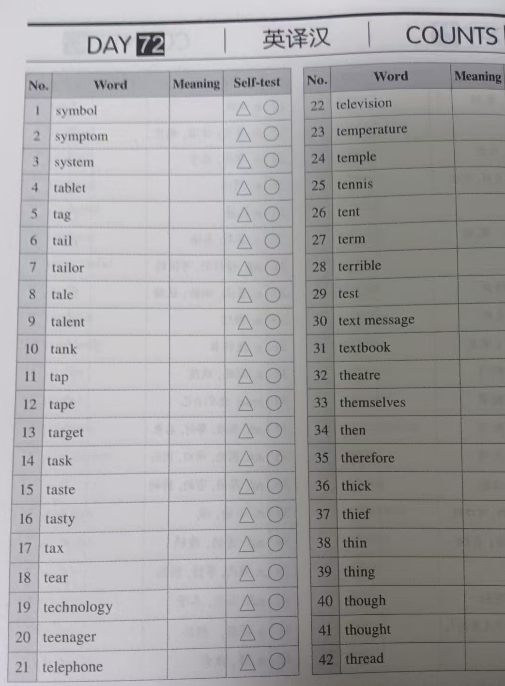
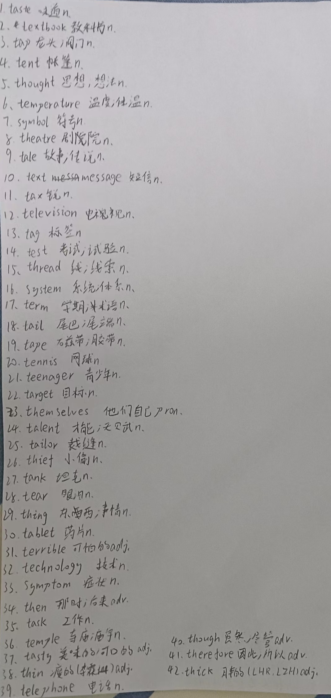

# 霖珊的学习记录 2025/07/21 ~ 2025/07/27

## 英语

### 背词汇表-1

- 内容：每周一个单元
- 检查方法：由浩然每周检查
- 奖惩：掷骰子+完美计划

??? success "达成完美计划，奖励 120 元"

    - 骰子点数：6、3
    - 错误数：0
    - 应发奖励：60 人民币
    - 扣除奖励：0 人民币
    - 达成完美计划
    - 实际奖励：120 人民币

<figure markdown>
  
  <figcaption>
词汇表Unit34-1
</figcaption>
  
  <figcaption>
词汇表Unit34-2
</figcaption>
</figure>

<figure markdown>
  
  <figcaption>
词汇表Unit34-听写
</figcaption>
</figure>

### 背词汇表-2

- 内容：每周一个单元
- 检查方法：由浩然每周检查
- 奖惩：掷骰子+完美计划

??? success "达成完美计划，奖励 120 元"

    - 骰子点数：6、3
    - 错误数：0
    - 应发奖励：60 人民币
    - 扣除奖励：0 人民币
    - 达成完美计划
    - 实际奖励：120 人民币

<figure markdown>
  
  <figcaption>
词汇表Unit35-1
</figcaption>
  
  <figcaption>
词汇表Unit35-2
</figcaption>
</figure>

<figure markdown>
  
  <figcaption>
词汇表Unit35-听写
</figcaption>
</figure>

### 背词汇表-3

- 内容：每周一个单元
- 检查方法：由浩然每周检查
- 奖惩：掷骰子+完美计划

??? success "达成完美计划，奖励 120 元"

    - 骰子点数：6、3
    - 错误数：0
    - 应发奖励：60 人民币
    - 扣除奖励：0 人民币
    - 达成完美计划
    - 实际奖励：120 人民币

<figure markdown>
  
  <figcaption>
词汇表Unit36-1
</figcaption>
  
  <figcaption>
词汇表Unit36-2
</figcaption>
</figure>

<figure markdown>
  
  <figcaption>
词汇表Unit36-听写
</figcaption>
</figure>

