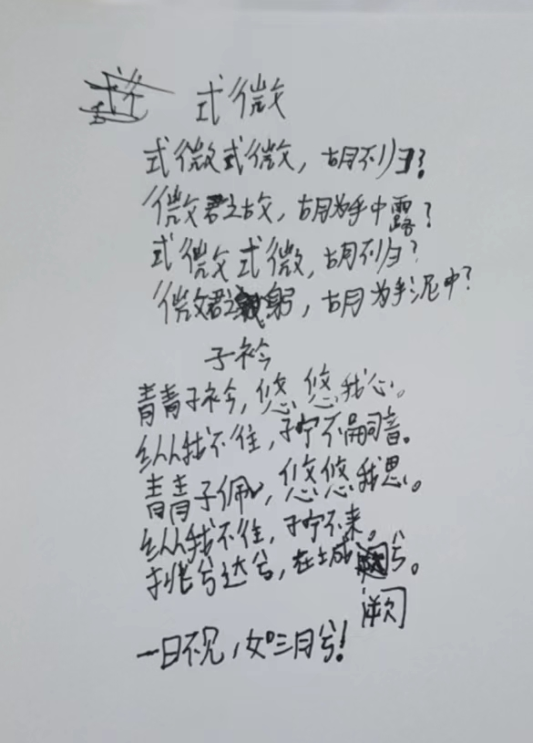
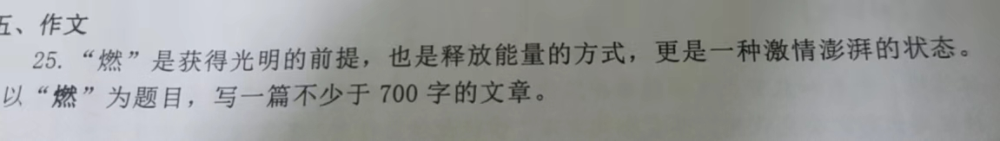
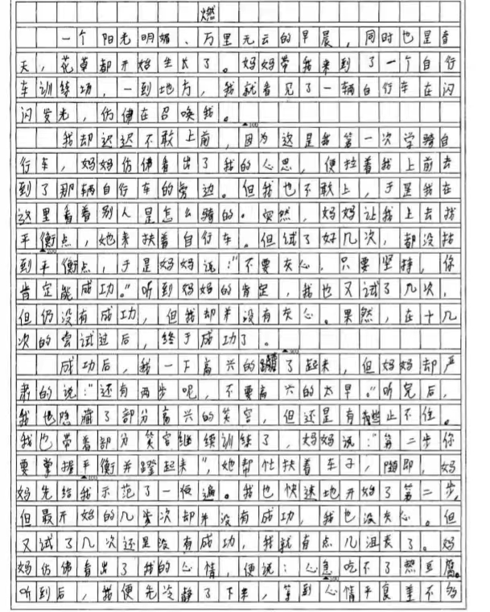
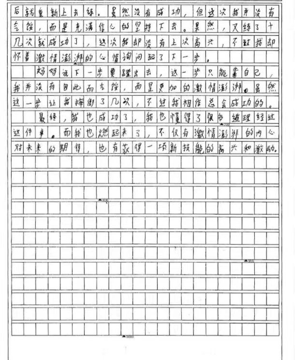

# 政宏的学习计划 2024/05/13 ~ 2024/05/19

## 语文

### 1. 背诵课内古诗和文言文

- 内容：每周从以下种类中选一个背诵
    - 古诗
    - 文言文原文
    - 文言文词义+全文翻译
- 程度
    - 古诗/文言文原文：背熟+默写
    - 文言文词义/全文翻译：照着原文能够说出来
- 检查方法：霖珊检查，录音发送至浩然
- 奖惩：50 人民币
- 备注：已发放奖励 50 人民币
- [x] 已达成

#### 古诗背诵

<figure>
    <figcaption>
式微
</figcaption>
    <audio controls src="assets/poem_1.m4a"></audio>
    <figcaption>
子衿
</figcaption>
    <audio controls src="assets/poem_2.m4a"></audio>
</figure>

#### 古诗默写

<figure markdown>
  
  <figcaption>
古诗默写
</figcaption>
</figure>

### 2. 作文
- 内容：每周写一篇作文
    - 可以跟之前的主题重复，但不能完全一样
    - 700 字以上
    - 找霖珊和浩然阅读并寻求意见
- 奖惩：50 人民币 $\times$ 百分制评分 （ 评分准则待定 ）
- 备注：待打分
- [x] 已达成

<figure markdown>
  
  <figcaption>
作文题目
</figcaption>
</figure>

<figure markdown>
  
  <figcaption>
作文片段1
</figcaption>
  
  <figcaption>
作文片段2
</figcaption>
</figure>

